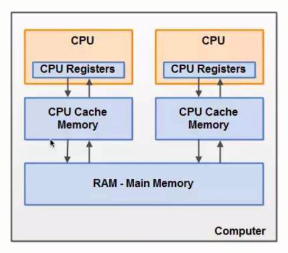
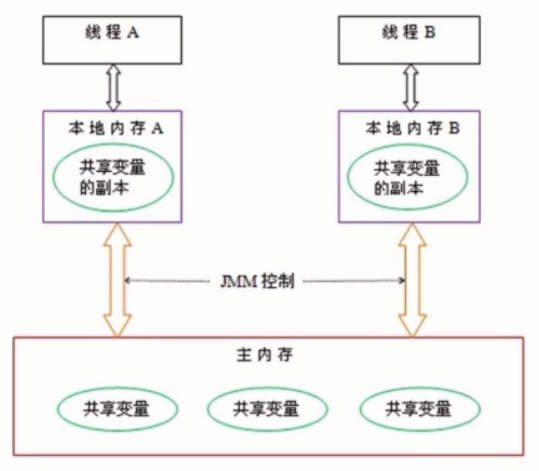
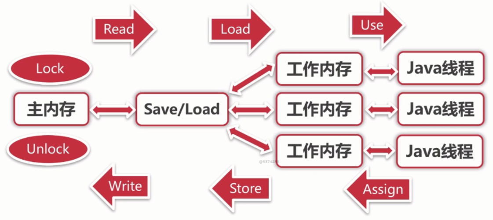
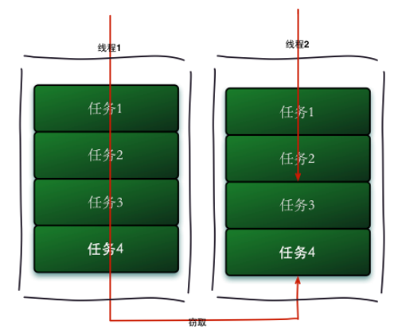

### 相关概念
#### 并发
并发是指多个线程同时处于执行的某个状态，交替地使用系统资源来处理任务。使用并发具有以下优势：
- 速度：同时处理多个任务，响应更快
- 资源利用：在等待IO时处理其他任务
并发同时也存在风险：
- 安全性：多线程共享数据时可能会产生与期望不符的结果
- 活跃性：某个操作无法继续进行，就会发生活跃性问题，如死锁、饥饿等问题
- 性能：线程过多使得CPU频繁切换，调度时间增多；同步机制限制编译器优化；线程过多消耗内存

#### CPU高速缓存
CPU执行速度很快，而从内存读取数据和向内存写入数据的过程跟CPU执行指令的速度比起来要慢的多。CPU高速缓存的出现是为了缓解CPU和内存之间速度不匹配的问题（CPU - cache - memory）。
当程序运行时，会将需要的数据从主存中复制一份到CPU的高速缓存中，当CPU执行指令时直接在缓存中存取数据，在之后的某个时间点，再将缓存中的数据刷新到主存中。



##### CPU高速缓存的意义
缓存容量远远小于主存，缓存无法命中CPU所需数据的情况在所难免，缓存的意义如下
- 时间局部性：如果某个数据被访问，那么不久的将来它很可能被再次访问
- 空间局部性：如果某个数据被访问，那么与它相邻的数据很快也可能被访问

##### 缓存一致性协议（MESI协议）
在多线程运行环境下，存在多份高速缓存，如果多个线程对多份缓存中的同一变量都做了修改，就有可能出现数据不一致的情况。为了保证多个CPU cache之间缓存共享数据的一致，采用MESI协议，其核心思想是：当CPU写数据时，如果发现操作的变量是共享变量，即在其他CPU中也存在该变量的副本，会发出信号通知其他CPU将该变量的缓存行置为无效状态，因此当其他CPU需要读取这个变量时，发现自己缓存中缓存该变量的缓存行是无效的，那么它就会从内存重新读取。
- M(Modified): 数据被修改，与内存中的数据不一致，只存在本cache中
- E(Exclusive): 数据有效，与内存中的数据一致，数据只存在本cache中
- S(Shared): 数据有效，与内存中的数据一致，数据存在多份cache中
- I(Invalid): 数据无效

#### Java内存模型
Java内存模型规定了所有变量都存储在主内存中，每个线程都有自己的工作内存（CPU寄存器和高速缓存的抽象），工作内存中保存了线程使用到的变量的副本拷贝，线程对变量的读写都必须在工作内存中进行，在之后的某个时间点再将工作内存中的变量同步到主内存中。不同线程无法直接访问对方工作内存的变量，必须通过主内存来进行通信，如果没有同步规则，就容易发生错误。



##### 同步操作

- lock（锁定）：作用于主内存的变量，把一个变量标识为一条线程独占状态
- unlock（解锁）：作用于主内存变量，把一个处于锁定状态的变量释放出来，释放后的变量才可以被其他线程锁定
- read（读取）：作用于主内存变量，把一个变量值从主内存传输到线程的工作内存中，以便随后的load动作使用
- load（载入）：作用于工作内存的变量，它把read操作从主内存中得到的变量值放入工作内存的变量副本中
- use（使用）：作用于工作内存的变量，把工作内存中的一个变量值传递给执行引擎，每当虚拟机遇到一个需要使用变量的值的字节码指令时将会执行这个操作
- assign（赋值）：作用于工作内存的变量，它把一个从执行引擎接收到的值赋值给工作内存的变量，每当虚拟机遇到一个给变量赋值的字节码指令时执行这个操作
- store（存储）：作用于工作内存的变量，把工作内存中的一个变量的值传送到主内存中，以便随后的write的操作
- write（写入）：作用于主内存的变量，它把store操作从工作内存中一个变量的值传送到主内存的变量中

如果要把一个变量从主内存中复制到工作内存，就需要按顺寻地执行read和load操作，如果把变量从工作内存中同步回主内存中，就要按顺序地执行store和write操作。Java内存模型只要求上述操作必须按顺序执行，而没有保证必须是连续执行。也就是

### 线程安全性
当多个线程访问某个类时，不管运行时环境采用何种调度方式或将这些进程如何交替执行，并且不需要任何额外的同步或协同，这个类都能表现出正确的行为。

- 原子性：互斥访问，同一时刻只有一个线程操作
- 可见性：线程对主内存的修改可以及时被其它线程观察到
- 有序性：线程观察其它线程中的指令执行顺序，由于指令重排序的存在，该观察结果一般杂乱无序

#### 原子性
##### CAS(Compare And Swap)
线程安全的实现方式之一是加锁，但是在多线程并发执行的情况下，加锁和释放会导致较多的上下文切换、导致死锁问题等。
CAS是一种不通过加锁，使用非阻塞方式实现线程安全的方式，发生冲突导致失败时就重试，直到成功。CAS有三个操作参数：内存地址、期望值、修改值，其核心操作是读取某内存地址中的值与期望值进行比较，当他们相同时才将该内存位置的值修改为修改值，若不相同，说明内存中的值已被其他线程修改，则将读取的内存中的值赋给期望值，重新进行读取、比较操作。比较和置换是作为单个原子操作实现的。

```
/**
 * @param obj 当前对象
 * @param valueOffset 期望当前值
 * @param newValue 新值
 */
public final Object getAndSetObject(Object obj, long valueOffset, Object newValue) {
    // 内存返回值
    Object valueInMemo;
    do {
        valueInMemo = this.getObjectVolatile(obj, valueOffset);
    } while(!this.compareAndSwapObject(obj, valueOffset, valueInMemo, newValue));
    return valueInMemo;
}
```

###### CAS的ABA问题
从内存中读取和比较之间，内存中的值可能被多次修改，最终回到原来的值，这与设计思路是不相符的，为了解决这个问题，内存中的值可以引入版本号处理，只要内存变量被修改过，其版本号就会递增，比较时版本号与读取时不一致，即认为失败。

###### CAS的性能问题
当并发执行的线程数据很多，可能会导致重试多次。

##### 锁
###### synchronize
基于JVM，不可中断锁，适合竞争不激烈的情况，可读性好。当一个线程访问同步代码块时，它首先是需要得到锁才能执行同步代码，当退出或者抛出异常时必须要释放锁。
- 修饰代码块，作用于调用代码块的对象
- 修饰方法：作用于调用方法的对象
- 修饰静态方法：作用于类的所有对象
- 修饰类：作用于类的所有对象

###### Lock
依赖特殊CPU指令，可中断锁，多样化同步，竞争激烈时能维持常态。

#### 可见性
##### 导致共享变量在线程间不可见的原因
- 线程交叉执行
- 重排序结合线程交叉执行
- 共享变量更新后的值没有在工作内存与主存间及时更新

##### synchronized
- 线程加锁时，将清空工作内存中的共享变量的值，从而使用共享变量时从主内存中重新读取最新的值
- 线程解锁前，必须把共享变量的最新值刷新到内存中

##### volatile
volatile是通过内存屏障和静止重排序优化来实现可见性的，不能保证线程安全，可以利用其可见性作为不同线程间的同步标记。
- 对volatile变量写操作时，会在写操作后加入一条store屏障指令，将本地内存中的共享变量值刷新到主内存
- 对volatile变量读操作时，会在读操作前加入一条load屏障指令，从主内存中读取共享变量的值

#### 有序性
Java内存模型中，允许编译器和处理器对指令进行重排序，重排序过程不会影响到单线程程序的执行，却可能会影响到多线程并发执行的正确性。

##### happens-before（先行发生原则）
如果两个操作的执行次序无法从happens-before原则推导出来，那么久不能保证有序性，虚拟机可以对它们进行重排序。
- 程序次序原则：一个线程内，按照代码规则，书写在前面的操作先行发生于书写在后面的操作
- 锁定规则：同一个锁的加锁操作必须发生于这个锁的释放操作之前
- volatile变量规则：对一个变量的写操作先行发生于后面对这个变量的读操作
- 传递规则：若操作A先行发生于操作B，操作B先行发生于操作C，则操作A先行发生于操作C
- 线程启动规则：Thread的start()方法先行发生于此线程的每一个动作
- 线程中断规则：对线程interrupt()方法的调用先行发生于被中断线程的代码检测到中断事件的发生
- 线程终结规则：线程中的所有的操作都先行发生于线程的终止检测，我们可以通过Thread.join()方法结束、Thread.isAlive()的返回值手段检测到线程已经终止执行
- 对象终结规则：一个对象的初始化完成先行发生于他的finalize()方法的开始

### 安全发布对象
- 发布对象：使一个对象能够被当前范围之外的代码所使用
- 对象逸出：一种错误的发布。当一个对象还没有构造完成时，就使它被其它线程所见

#### 安全发布方法
- 在静态初始化函数中初始化一个对象引用
- 将对象的引用保存到volatile类型域或者AtomicReference对象中
- 将对象的引用保存到某个正确构造方对象的final类型域中
- 将对象的引用保存到一个由锁保护的域中

#### 单例模式
##### 懒汉模式
懒汉模式是在第一次使用时创建单例实例。创建单例时，在获取单例的静态方法上加锁会造成性能开销；使用双重检测机制在指令重排序的情况下会造成线程不安全。因此使用懒汉模式创建单例应使用volatile关键字+双重检测机制。
```
public class LazySingleton {

    /**
     * 私有构造函数
     */
    private LazySingleton() {
    }

    /**
     * 单例对象
     * volatile + 双重检测机制 -> 禁止重排序
     */
    private volatile static LazySingleton instance = null;

    /**
     * instance = new LazySingleton();
     * 1.分配对象内存空间
     * 2.初始化对象
     * 3.设置instance指向刚分配的内存
     *
     * JVM和CPU优化，发生了指令重排序 1-3-2，线程A执行完3，线程B执行第一个判空，直接返回
     * 通过volatile关键字禁止重排序
     *
     * @return
     */
    public static LazySingleton getInstance() {
        if (null == instance) {
            synchronized (LazySingleton.class) {
                if (null == instance) {
                    // 双重检测
                    instance = new LazySingleton();
                }
            }
        }
        return instance;
    }
}
```

##### 饿汉模式
饿汉模式是在类装载时创建单例实例。
```
public class HungrySingleton {

    /**
     * 私有构造函数
     */
    private HungrySingleton() {
    }

    /**
     * 单例对象
     */
    private static HungrySingleton instance = new HungrySingleton();

    public static HungrySingleton getInstance() {
        return instance;
    }
}
```

##### 使用枚举的单例模式
```
public class EnumSingleton {

    private EnumSingleton() {
    }

    private static EnumSingleton getInstance() {
        return Singleton.INSTANCE.getInstance();
    }

    private enum Singleton {
        INSTANCE;

        private EnumSingleton instance;

        /**
         * JVM保证该方法只调用一次
         */
        Singleton() {
            instance = new EnumSingleton();
        }

        public EnumSingleton getInstance() {
            return instance;
        }
    }
}
```

### 线程安全策略
#### 不可变对象
将对象设计为不可变对象实际上是对并发造成的线程安全问题的规避，不可变对象需要满足以下条件：
- 对象创建后其状态不能修改
- 对象所有域都是final类型
- 对象是正确创建的（在对象创建期间，this引用没有逸出）

##### final关键字
- 修饰类：不能被继承（被修饰类的所有方法都被隐式修饰为final方法）
- 修饰方法：锁定方法不能被继承类修改（private方法会被隐式修饰为final方法）
- 修饰变量：被修饰的基本数据类型变量的数值被初始化后便不能被修改；被修饰的引用类型变量被初始化后便不能指向另一个对象

##### unmodifiable与Immutable
分别由java.util.collections和com.google.collect包提供只读视图，对集合修改操作的实现均以抛出异常代替。

#### 线程封闭
把对象封装到一个线程里，只有这一个线程能访问到这个对象。
- Ad-hoc线程封闭：程序控制实现。
- 堆栈封闭：局部变量，不会产生线程安全问题。
- ThreadLocal线程封闭：ThreadLocal是为每一个线程创建一个单独的变量副本，故而每个线程都可以独立地改变自己所拥有的变量副本，而不会影响其他线程所对应的副本。

#### 常见线程不安全类
- StringBuilder -> StringBuffer
- SimpleDateFormat -> JodaTime

#### 常用同步容器
采用synchronize实现线程安全的常用同步容器。
- ArrayList -> Vector
- HashMap -> HashTable
- Collection -> Collections.synchronized...

#### 安全共享对象策略
- 线程限制：一个被线程限制的对象，由线程独占，并且只能被占有它的线程修改
- 共享只读：一个共享只读的对象，在没有额外同步情况下可以被多个线程并发访问，但是任何线程都不能修改它
- 线程安全对象：一个线程安全的对象或容器，在内部通过同步机制来保证线程安全，所以其他线程无需额外同步就可以通过公共接口随意访问它
- 被守护对象：被守护对象只能通过获取特定的锁来访问

#### 并发容器
- CopyOnWriteArrayList：新增元素时先加锁，将原数组拷贝到新数组，元素加入新数组后再把引用指向新数组。每次新增都需要拷贝，且新增操作未完成时，其它线程可能会读取到旧的数据。适合大量读、少量写的操作。
- CopyOnWriteArraySet：基于CopyOnWriteArrayList

### J.U.C
J.U.C是指java.util.concurrent包。AQS是指java.util.concurrent.locks.AbstractQueuedSynchronizer。
#### CountDownLatch

CountDownLatch可以看作是一个计数器，其内部维护着一个count计数，对这个计数器的操作都是原子操作，同时只能有一个线程去操作这个计数器，CountDownLatch通过构造函数传入一个初始计数值，调用者可以通过调用CountDownLatch对象的countDown()方法来使计数减1，如果调用CountDownLatch对象的await()方法，那么线程就会一直阻塞，直到countDown()方法将计数减到0，才可以继续执行。await()方法允许设置超时参数。

```
ExecutorService executorService = Executors.newCachedThreadPool();
final CountDownLatch countDownLatch = new CountDownLatch(requestCount);
for (int i = 0; i < requestCount; i++) {
    final int threadNum = i;
    executorService.execute(() -> {
        // execute task...
        countDownLatch.countDown();
    });
}
countDownLatch.await();
```
#### Semaphore
Semaphore是计数信号量，用于限制获取某种资源的线程数量。在共享资源使用前和使用完成后，分别调用Semaphore的acquire()和release()方法获取和释放许可。
```
ExecutorService executorService = Executors.newCachedThreadPool();
final Semaphore semaphore = new Semaphore(threadCount);
for (int i = 0; i < requestCount; i++) {
    final int threadNum = i;
    executorService.execute(() -> {
        // 获取许可
        semaphore.acquire();
        // 一次获取多个许可
        // semaphore.acquire(10);
        // 尝试获取许可，获取不到就放弃
        // semaphore.tryAcquire(5000, TimeUnit.MILLISECONDS);
        // execute task...
        // 释放许可
        semaphore.release();
    });
}
```

#### CyclicBarrier
CyclicBarrier允许一组线程相互等待，直到每个线程都到达屏障点之后才能执行后续操作，线程通过调用CyclicBarrier对象的await()方法通知自己已到达屏障，然后被阻塞。CyclicBarrier可以用于多线程计算数据，最后合并计算结果的应用场景。CountDownLatch的计数器只能使用一次，其描述的是一个或多个线程等待其他线程的关系；而CyclicBarrier的计数器可以使用reset()方法重置，其描述的是多个线程相互等待的关系。
```
ExecutorService executorService = Executors.newCachedThreadPool();
final CyclicBarrier cyclicBarrier = new CyclicBarrier(reachBarrierCount);
for (int i = 0; i < 10; i++) {
    final int threadNum = i;
    executorService.execute(()->{
        log.info("{} ready", threadNum);
        cyclicBarrier.await();
        log.info("{} continue", threadNum);
    });
}
```

在申明CyclicBarrier时可以指定Runnable，在要求数量的线程都到达屏障时优先执行。
```
CyclicBarrier cyclicBarrier = new CyclicBarrier(reachBarrierCount, new Runnable() {
    @Override
    public void run() {
        // all reach barrier do something before continue
    }
});
```

#### Lock
synchronized是JVM层面的实现，Lock是JDK层面的实现，需要保证锁手工释放。
```
final Lock lock = new ReentrantLock();
ExecutorService executorService = Executors.newCachedThreadPool();
final Semaphore semaphore = new Semaphore(threadCount);
CountDownLatch countDownLatch = new CountDownLatch(requestCount);
for (int i = 0; i < requestCount; i++) {
    executorService.execute(() -> {
        try {
            semaphore.acquire();
            lock.lock();
            try {
                count++;
            } finally {
                lock.unlock();
            }
            semaphore.release();
        } catch (Exception e) {
            log.info("Exception: {}", e);
        }
        countDownLatch.countDown();
    });
}
countDownLatch.await();
```
ReentrantLock是一种独占锁，即同一时间只有一个线程能获得锁，但是读操作与读操作之间是不存在互斥关系的。因此引入ReentrantReadWriteLock，它的特性是：一个资源可以被多个读操作访问，或者一个写操作访问，但两者不能同时进行。然而当读取很多，写入很少的情况时，使用 ReentrantReadWriteLock 可能会使写入线程遭遇饥饿问题。
StampedLock控制锁有三种模式（写，读，乐观读），一个StampedLock状态是由版本和模式两个部分组成，锁获取方法返回一个数字作为票据stamp，它用相应的锁状态表示并控制访问，数字0表示没有写锁被授权访问。在读锁上分为悲观锁和乐观锁。所谓的乐观读模式，也就是若读的操作很多，写的操作很少的情况下，你可以乐观地认为，写入与读取同时发生几率很少，因此不悲观地使用完全的读取锁定，程序可以查看读取资料之后，是否遭到写入执行的变更，再采取后续的措施（重新读取变更信息，或者抛出异常）。
```
final StampedLock lock = new StampedLock();
ExecutorService executorService = Executors.newCachedThreadPool();
final Semaphore semaphore = new Semaphore(threadCount);
CountDownLatch countDownLatch = new CountDownLatch(requestCount);
for (int i = 0; i < requestCount; i++) {
    executorService.execute(() -> {
        try {
            semaphore.acquire();
            long stamp = lock.lock();
            try {
                count++;
            } finally {
                lock.unlock(stamp);
            }
            semaphore.release();
        } catch (Exception e) {
            log.info("Exception: {}", e);
        }
        countDownLatch.countDown();
    });
}
countDownLatch.await();
```

##### 锁的选择
- synchronized：当只有少量竞争者时
- ReentrantLock：竞争者不少，但是线程增长的趋势可以预估

#### FutureTask
Thread和Runnable创建的线程在执行完成后无法获取执行结果，但是自Java 1.5开始就提供了Callable和Future接口在任务执行完毕后获取结果。
```
/**
 * 实现Callable接口的call()方法可以获取线程返回结果
 */
public interface Callable<V> {

    V call() throws Exception;
}

/**
 * Future就是对于具体的Runnable或者Callable任务的执行结果进行取消、查询是否取消、查询是否完成、获取结果。
 * 必要时可以通过get()方法获取执行结果，该方法会阻塞直到任务返回结果。
 */
public interface Future<V> {
    boolean cancel(boolean mayInterruptIfRunning);
    boolean isCancelled();
    boolean isDone();
    V get() throws InterruptedException, ExecutionException;
    V get(long timeout, TimeUnit unit) throws InterruptedException, ExecutionException, TimeoutException;
}
```

FutureTask实现了RunnableFuture接口，而RunnableFuture接口继承了Runnable和Future接口，所以FutureTask既可以作为Runnable被线程执行，又可以作为Future得到Callable的返回值。

```
// Callable + Future
Future<String> future = executorService.submit(new Callable<String>() {
    @Override
    public String call() throws Exception {
        log.info("do something in callable");
        Thread.sleep(3000);
        return "Done";
    }
});
String result = future.get();

// Callable + FutureTask
FutureTask<String> futureTask = new FutureTask<String>(new Callable<String>() {
    @Override
    public String call() throws Exception {
        log.info("do something in callable");
        Thread.sleep(3000);
        return "Done";
    }
});
new Thread(futureTask).start();
String result = futureTask.get();
```

#### Fork/Join框架
Fork/Join框架是Java7提供了的一个用于并行执行任务的框架， 是一个把大任务分割成若干个小任务，最终汇总每个小任务结果后得到大任务结果的框架。
##### 工作窃取算法
工作窃取（work-stealing）算法是指某个线程从其他队列里窃取任务来执行。工作窃取的运行流程图如下：


对于一个比较大的任务，可以把这个任务分割为若干互不依赖的子任务，为了减少线程间的竞争，这些子任务分别放到不同的队列里，每个队列创建一个单独的线程来执行队列里的任务，线程和队列一一对应。但是有的线程会先把自己队列里的任务干完，而其他线程对应的队列里还有任务等待处理。已经完成任务的线程就会去其他线程的队列里窃取一个任务来执行。而在这时它们会访问同一个队列，所以为了减少窃取任务线程和被窃取任务线程之间的竞争，通常会使用双端队列，被窃取任务线程永远从双端队列的头部拿任务执行，而窃取任务的线程永远从双端队列的尾部拿任务执行。工作窃取算法的优点是充分利用线程进行并行计算，并减少了线程间的竞争，其缺点是在某些情况下还是存在竞争，比如双端队列里只有一个任务时。并且消耗了更多的系统资源；比如创建多个线程和多个双端队列。

```
@Slf4j
@AllArgsConstructor
public class ForkJoinTaskExample extends RecursiveTask<Integer> {

    private static final int THRESHOLD = 2;

    private int start;

    private int end;

    @Override
    protected Integer compute() {
        int sum = 0;

        // 任务足够小就计算
        boolean canCompute = (end - start) <= THRESHOLD;
        if (canCompute) {
            for (int i = start; i <= end; i++) {
                sum += i;
            }
        } else {
            int middle = (start + end) / 2;
            ForkJoinTaskExample leftTask = new ForkJoinTaskExample(start, middle);
            ForkJoinTaskExample rightTask = new ForkJoinTaskExample(middle + 1, end);

            // 执行子任务，调用compute()方法继续拆分，直到任务足够小
            leftTask.fork();
            rightTask.fork();

            // 分别获取子任务计算结果
            Integer leftResult = leftTask.join();
            Integer rightResult = rightTask.join();
            sum = leftResult + rightResult;
        }
        return sum;
    }

    public static void main(String[] args) {
        ForkJoinPool forkJoinPool = new ForkJoinPool();
        ForkJoinTaskExample task = new ForkJoinTaskExample(1, 100);
        Future<Integer> result = forkJoinPool.submit(task);

        try {
            log.info("result: {}", result.get());
        } catch (Exception e) {
            log.error("exception", e);
        }
    }
}
```
ForkJoinTask需要实现compute()方法，在这个方法里，首先需要判断任务是否足够小，如果足够小就直接执行任务并返回结果。如果不足够小，就必须分割成子任务，每个子任务在调用fork()方法时，又会进入compute()方法查看当前子任务是否需要继续分割。使用join()方法会等待子任务执行完并得到其结果。

#### 线程池
线程池是指在初始化一个多线程应用程序过程中创建一个线程集合，在需要执行新的任务时重用这些线程而不是新建一个线程。线程池中的每个线程都在等待或执行任务，一旦任务已经完成，线程就会回到线程池中等待下一次任务。

##### 线程池的优点
- 重用存在的线程，减少对象创建、消亡的开销，从而提升性能
- 可有效控制最大并发线程数，提高系统资源利用率，同时可以避免过多资源竞争，避免阻塞
- 提供定时执行、定期执行、单线程、并发控制等功能

##### ThreadPoolExecutor

###### 属性
- corePoolSize：核心线程数量
- maximumPoolSize：最大线程数
- workQueue：阻塞队列，存储等待执行的任务 
- keepAliveTime：线程没有任务时的最长保留时间
- threadFactory：线程工厂，用来创建线程
- rejectHandler：拒绝处理任务时的策略

###### 方法
- execute()：提交任务
- submit()：提交任务，能够返回结果
- shutDown()：关闭线程池，等待任务都执行完
- shutDownNow()：关闭线程池，不等待任务执行完
- getTaskCount()：线程池已执行和未执行的任务总数
- getCompletedTaskCount()：已完成的任务数量
- getPoolSize()：线程池当前线程数量
- getActiveCount()：当前线程池中正在执行任务的线程数量

###### J.U.C提供的线程池
- Executors.newCachedThreadPool()：灵活创建线程
- Executors.newFixedThreadPool()：定长线程池
- Executors.newScheduledThreadPool()：支持定时和周期性的任务执行
- Executors.newSingleThreadPool()：创建只有一个线程的线程池，保证任务顺序执行

##### 线程池配置
- CPU密集型任务：参考值设为CPU数+1
- IO密集型任务：参考值设为2*CPU数

### 多线程并发最佳实践
#### 死锁
如果一组进程中的每一个进程都在等待仅由该组进程中的其他进程才能引发的事件，那么该组进程是死锁的。
##### 死锁的条件
（1）互斥条件，在一段时间内，某资源只能被一个进程占用。
（2）请求和保持条件，某进程已经保持了至少一个资源，但又提出了新的资源请求，而该资源已被其他进程占有，此时请求进程被阻塞，但对自己已持有的资源保持不放。
（3）不可抢占条件，进程已获得的资源在未使用完之前不能被抢占，只能在进程使用完时由自己释放。
（4）循环等待条件，在发生死锁时，必然存在一个进程—资源的循环链

#### 多线程编程最佳实践
- 使用本地变量
- 使用不可变类
- 最小化锁的范围
- 使用线程池，而不是每次创建新的线程
- 使用同步工具优于线程的wait()和notify()
- 使用BlockingQueue实现生产-消费模式
- 使用并发集合而不是加了锁的同步集合
- 使用Semaphore创建有界的访问
- 使用同步方法块由于同步方法
- 避免使用static变量

### 高并发问题策略
#### 扩容
线程占用内存的大小取决于其工作内存中变量的多少，随着并发量增加，可能就需要增加内存或服务器。
- 垂直扩容：提高系统部件能力
- 水平扩容：增加更多系统成员

#### 缓存
##### 缓存特征
- 命中率：命中数 / 总请求数量
- 最大元素：缓存所占空间受限制
- 清空策略：FIFO先进先出、LFU最少使用、LRU最近最少使用、过期时间等
##### 命中率的影响因素
- 业务场景和业务需求：要求读多的情况使用缓存
- 缓存的设计（粒度和策略）：缓存粒度越小，越灵活，命中率越高；数据发送变化时，更新缓存而不是移除缓存可以提高命中率
- 缓存容量和基础设施：缓存容量受空间限制；单机缓存有瓶颈，分布式缓存易扩展
##### 缓存问题
- 缓存一致性：缓存一致性要求缓存中的数据与数据库中的数据一致，缓存节点与副本中的数据一致，这就依赖缓存的过期和更新策略。
- 缓存并发问题：当缓存过期时可能有多个线程从后端系统获取数据，这可能对后端系统造成极大的冲击；当某个key正在更新时对这个key的读操作会产生一致性问题。
- 缓存穿透/击穿问题：高并发场景下多个线程对一个实际没有value的key进行查询，在未命中后会去访问后端系统，对后端系统造成不必要的压力，在这种情况下可以缓存空对象，避免请求穿透到后端系统。
- 缓存雪崩：缓存集中在某一个时间点失效，对后端系统造成很大压力，在这种情况下可以针对具体业务设置不同的缓存时间。

#### 消息队列
##### 特性
- 业务无关：只做消息分发
- FIFO：先投递先到达
- 容灾：节点的动态增删和消息的持久化
- 性能：吞吐量提升，系统内部通信效率提高
##### 消息队列解决的问题
- 生产和消费的速度和稳定性等因素不一致时，消息队列作为缓冲
- 业务解耦，只关心业务核心处理，其它任务交由消息队列分发处理
- 最终一致性，失败重试
- 广播，新接入的业务方订阅消息自行处理
- 错峰与流控，利用消息队列转储任务，在下游系统有能力时再对任务进行处理

#### 应用拆分
单个服务器的处理是有上限的，可以将一个庞大的应用按照某种规则拆分成多个应用，分开部署。
##### 应用拆分原则
- 业务优先：按照业务边界对系统进行拆分
- 循序渐进：拆分后要保证系统功能完整
- 兼顾技术：系统拆分代价是高昂的，在拆分的同时对系统进行重构和分层
- 可靠测试：测试通过后才进行下一步的拆分
- 通信：RPC、消息队列
- 数据库：每个应用都有独立的数据库
- 拆分避免事务操作跨应用
##### 微服务
微服务是通过将功能分解到各个离散的服务中以实现对解决方案的解耦，提供更加灵活的服务支持。微服务把一个大型的单个应用程序和服务拆分为数个甚至数十个的支持微服务，它可扩展单个组件而不是整个的应用程序堆栈，从而满足服务等级协议。微服务围绕业务领域组件来创建应用，这些应用可独立地进行开发、管理和迭代。在分散的组件中使用云架构和平台式部署、管理和服务功能，使产品交付变得更加简单。其本质是用一些功能比较明确、业务比较精练的服务去解决更大、更实际的问题。

#### 应用限流
应用限流就是通过对并发访问/请求进行限制，从而达到保护系统的目的。
##### 限流算法
- 计数器法：限制一定时间内的并发数（无法解决临界问题）
- 滑动窗口算法：固定时间段为一格，每格有独立的计数器，多格构成时间窗口
- 漏桶算法：请求进入漏桶，漏桶以固定速率漏出请求（执行请求），当一段时间内请求过多时就会溢出，不作处理
- 令牌桶算法：以一定的速率往桶里放令牌，每执行一个请求都要消耗一个令牌，当令牌桶中没有令牌可供消耗，则请求不作处理

#### 服务降级与服务熔断
##### 降级
降级指请求处理不了或出错时给一个默认的返回。
- 自动降级：超时、失败重试次数、故障、限流
- 人工降级：秒杀
##### 熔断
熔断指系统出现过载，为了防止造成整个系统故障而采取的措施。
##### 服务降级与服务熔断的比较
- 共性：目的一致，从可用性、可靠性着想，为了防止系统全面崩溃而使得某些服务暂时不可用；粒度大多为服务粒度；基于策略自动触发，很少人工干预
- 区别：服务降级是从整体负荷考虑的，服务熔断一般是由某个服务故障引起的

#### 切库、分库分表
当单个库的数据量过大或者单个库服务器由于读写瓶颈造成服务器压力过大时，需要考虑切库、分库分表.
##### 数据库切库
- 读写分离：数据库一般读多写少，读取占用的时间多，占用服务器CPU也较多，通常做法是把查询从主库中抽取出来，采用多个从库，使用负载均衡，减轻对原来单个数据库服务器的压力。
##### 数据库分库分表
当一个表数据量很大，大到即使做了sql和索引优化之后，基本操作的速度还是影响使用就必须考虑分表了。分表后单表的并发能力提高了，写操作效率也会提高；其次是查询时间变短了，数据分布在不同的文件里，磁盘的IO性能也提高了，磁盘读写锁影响的数据量变小，插入数据库需要重新建立的索引变少。 
