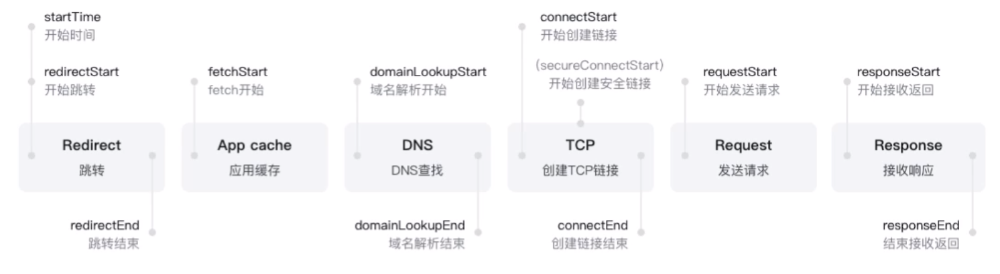
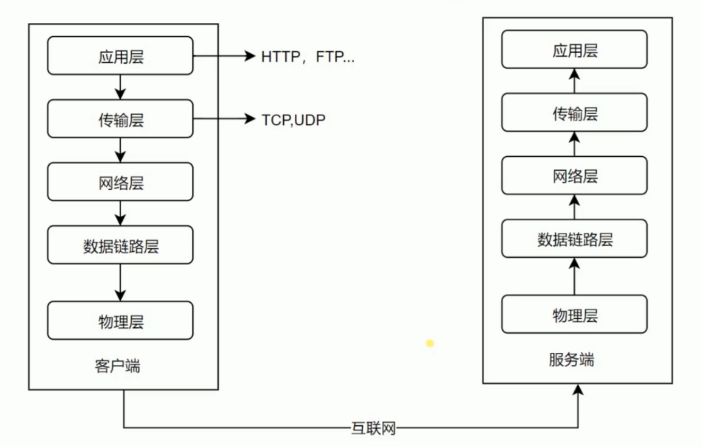
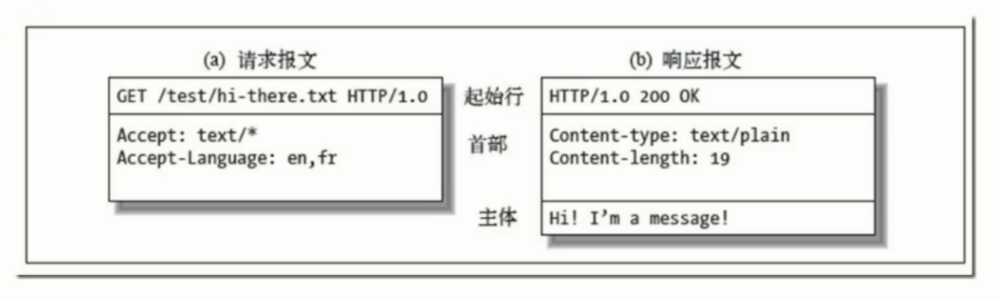

### HTTP协议基础
#### HTTP请求过程


#### 五层协议

- 物理层：网卡、端口、网线、光缆等硬件，主要作用是定义物理设备如何传输数据。
- 数据链路层：在通信实体间建立数据链路连接。
- 网络层：为数据在节点之间传输创建逻辑链路。
- 传输层：向用户提供可靠的端到端（End-to-End）服务，屏蔽了下层数据通信细节。
- 应用层：为软件应用提供服务，构建于TCP协议之上，屏蔽了网络传输的相关细节。

#### URI、URL与URN
- URI（Uniform Resource Identifier）：统一资源标志符（资源命名），用于唯一标识互联网上的信息资源，包含URL、URN。
- URL（Uniform Resource Location）：统一资源定位器（资源定位），表示可以从互联网上得到的资源的位置和访问方法。
- URN（Uniform Resource Name）：永久统一资源定位符，作为特定内容的唯一名称使用的，与当前资源的所在地无关，在资源移动后还能被找到。

#### HTTP协议报文


组成 | 请求报文 | 响应报文
| - | - | - |
起始行 | method、url、协议版本 | 协议版本、code、code明文
首部 | Header | Header
主体 | | Body

#### HTTP方法
HTTP method用于定义对资源的操作，常用的有GET/POST等，有各自对应的语义。

#### HTTP status code
HTTP状态码定义服务器对请求的处理结果，各个区间的CODE有各自的语义。
- 100~199表示操作要持续进行
- 200~299表示成功；300~399表示需要重定向，从他处获取数据
- 400~499表示请求有误
- 500~599表示服务器内部错误

### HTTP特性
#### 跨域
当浏览器从一个域名的网页去请求另一个域名的资源时，域名、端口、协议任一不同，都属于跨域，是受浏览器同源策略限制的请求场景。
- JSONP跨域：、<link>、<script>标签通过src或ref被浏览器允许从不同域名下加载静态资源。基于此原理，JSONP通过动态创建script，请求一个带参网址实现跨域。JSONP只支持GET请求。
- CORS跨域：Cross-Origin Resource Sharing, 跨源资源共享，使用自定义的HTTP头部让浏览器与服务器进行沟通。

#### 缓存
##### 可缓存性
- public：http经过的任何地方都可以进行缓存。
- private：只有发起请求的浏览器可以缓存。
- no-cache：禁止缓存。
##### 到期
可以通过设置max-age / s-maxage / max-stale来设置缓存的到期时间。
```
Cache-Control: max-age=20
``` 
#### Cookie
Cookie是服务端返回数据后通过Set-Cookie头保存在浏览器中的内容。在下次的同域请求时会带上Cookie，来保证通信是同一个用户。
#### Session
服务器可以为每个用户浏览器创建一个会话对象（session对象），需要保存用户数据时，服务器程序可以把用户数据写到用户浏览器独占的session中，当用户使用浏览器访问其它程序时，其它程序可以从用户的session中取出该用户的数据，为用户服务。
#### HTTP长连接
从HTTP/1.1起，HTTP协议默认使用长连接，用以保持连接特性。请求头包含以下代码：
```
Connection: keep-alive
```

HTTP协议的长连接和短连接，实质上是TCP协议的长连接和短连接。当使用HTTP长连接时，客户端和服务器之间用于传输数据的TCP连接不会关闭，客户端再次与这个服务器通信时，会继续使用已经建立的连接。Keep-Alive不会永久保持连接，它有一个保持时间。
#### 数据协商
在客户端发送请求给服务端时，服务端通过请求端发送的头信息来判断客户端想要的数据。
- Accept：请求数据类型
- Accept-Encoding：请求数据压缩类型
- Accept-Language：请求数据返回语言类型
- User-Agent：客户端浏览器数据
- Content-Type：返回内容数据格式
- Content-Encoding：返回数据压缩方式
- Content-Language：返回语言类型

