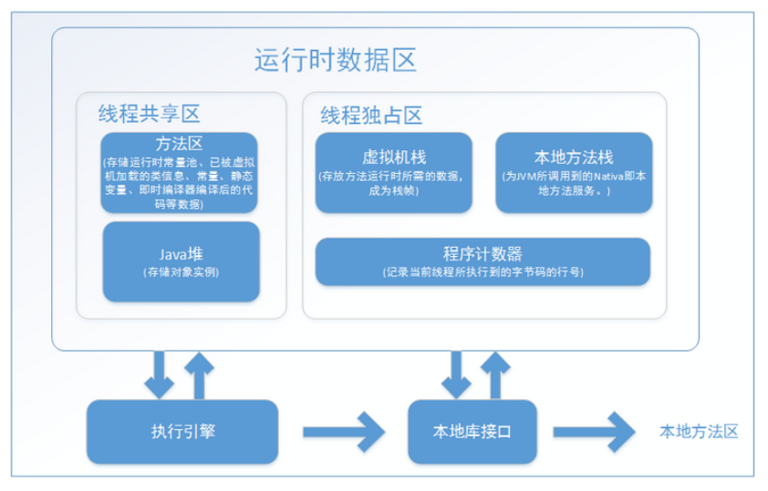
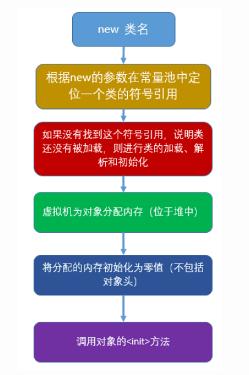
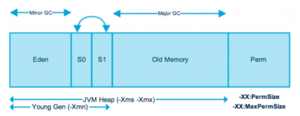
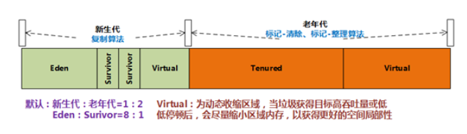
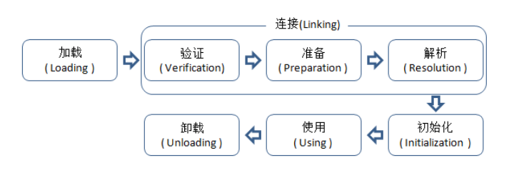
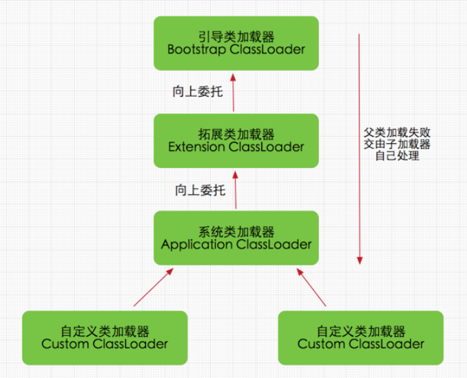

### Java Platform Standard Edition
Oracle有两款实现了Java SE的产品：Java SE Development Kit(JDK) 和 Java SE Runtime Environment(JRE)。
JDK是JRE的超集，包含了JRE的所有内容，以及开发应用程序所需的编译器和调试器等工具。JRE提供了函数库，Java Virtual Machine(JVM)和其它用来运行Java应用程序的组件。

### Java内存区域

#### 程序计数器
程序计数器是一块较小的内存空间，他的作用可以看做是当前线程所执行的字节码的行号指示器。每个线程都有一个程序计数器。如果线程执行的是Java方法，这个计数器记录的是正在执行的虚拟机字节码指令的地址。如果正在执行的是native方法，这个计数器的值为undefined。此区域是唯一一个在Java虚拟机规范中没有规定OutOfMemoryError情况的区域。

#### Java虚拟机栈
- 虚拟机栈描述的是Java方法执行的动态内存模型，调用方法即创建栈帧并入栈，方法执行完毕栈帧出栈。
- 栈帧： 每个方法执行，都会创建一个栈帧，伴随着方法从创建到执行完成。用于存储局部变量表，操作数栈，动态链接，方法出口等。
- 局部变量表：存放编译器可知的各种基本数据类型，引用类型，returnAddress类型。对象是在堆内存中创建的，局部变量表存放的是对象的引用，其大小是不会改变的。因此局部变量表的内存空间在编译期完成分配后，方法需要在帧分配多少内存是固定的。
- StackOverFlowError：当入栈的栈帧超出设定的内存，就会抛出栈内存溢出异常或内存溢出异常。

#### 本地方法栈
Java虚拟机栈为虚拟机执行Java方法服务，本地方法栈为虚拟机执行native方法服务。在HotSpot虚拟机实现中是把本地方法栈和虚拟机栈合二为一的。

#### Java堆
- 是数据运行时区域，对象实例和数组内存都要在堆上分配
- 所有类实例和数组的内存均从此处分配，堆是在JVM启动时创建的
- 是垃圾收集器管理的主要区域

#### 方法区
存储虚拟机加载的类信息（类的版本、字段、方法、接口）、常量、静态变量、即时编译器编译后的代码等数据。于Hotspot虚拟机来说，将方法区纳入GC管理范围，这样就不必单独管理方法区的内存，所以就有了相对于新生代和老年代的永久代一说。
- 运行时常量池(JDK6在方法区，JDK7在Java堆)：用来存放编辑器生成的各种字面量以及符号引用。
- 直接内存：NIO使用native函数库直接分配堆外内存，然后通过一个存储在Java堆中的DirectByteBuffer对象作为这块内存的引用进行操作。通过避免在Java堆和Native堆中来回复制数据来提高性能。

### 对象
#### 对象的创建

##### 给对象分配内存
- 指针碰撞：堆内存中的空闲空间十分的规整，使用与未使用的空间全部为连续，分配内存只需移动指针。
- 空闲列表：针对堆内存中的空间零散的存在，虚拟机维护着一个列表，记录那些内存未使用。

##### 线程安全性
- CAS失败重试：通过乐观锁实现线程安全
- TLAB(Thread Local Allocation Buffer)：本地线程分配缓冲，内存为每个线程分配一个TLAB区域，每个线程创建对象时在这个区域中创建，从而避免线程安全问题。当原来的空间不足时可以通过线程同步获取一块新的区域。

#### 对象的结构
##### 对象头(Header)
- 自身运行时数据：哈希值、GC分代年龄、锁状态标志、线程持有的锁、偏向线程ID、偏向时间戳
- 类型指针：对象指向它的类的元数据的指针，虚拟机通过这个指针来确定这个对象是哪个类的实例。

##### 实例数据(Instance Data)
实例数据是对象真正存储的有效信息，也是程序代码中所定义的各种类型的字段内容。

##### 对齐填充(Padding)
HotSpot虚拟机要求对象的起始地址必须是8字节的整数倍，也就是对象的大小必须是8字节的整数倍。而对象头部分正好是8字节的倍数（1倍或者2倍），因此，当对象实例数据部分没有对齐的时候，就需要通过对齐填充来补全。

#### 对象的访问定位
- 使用句柄：引用类型指向堆中一块区域（句柄池），此区域保存了实例对象的地址
- 直接指针：从引用类型直接指向内存区域

### 垃圾回收
在Java堆上分配一个内存给实例对象时，此时在虚拟机栈上引用型变量就会存放这个实例对象的起始地址。当线程销毁后，其在虚拟机栈上的内存自然会被回收，也就是说虚拟机栈上的这块内存不在虚拟机GC范围内。
#### 垃圾对象判定算法 
- 引用计数法：在对象中添加一个引用计数器，当有地方引用这个对象时，引用计数器的值+1，当引用失效时，计数器的值-1。垃圾回收器遇到计数器为0的对象时就会回收。但是当堆内存中的对象相互引用，而外部不存在对这些对象的引用时，计数器值不为0，无法判定回收。
- 可达性分析法：通过一系列名为GC Roots的对象（虚拟机栈、方法区类属性所引用的对象、方法区中常量所引用的对象、本地方法栈中引用的对象）作为起始点，从这些节点开始向下搜索，搜索所走过的路径称为引用链(Reference Chain)，当一个对象到GC Roots没有任何引用链相连时，则此对象证明是不可用的，将被判定为可回收对象。

#### 如何回收
##### 回收策略
- 标记-清除算法：标记可达对象，在清除阶段回收并没有被标记为可达的对象所占用的内存空间，并将原来的可达标记删除。但是效率不高且会造成内存碎片化。
- 复制算法：标记待回收内存和不需回收的内存，将不需回收的内存复制到新的内存区域，这样旧的内存区域就可以全部回收，而新的内存区域是连续的。其缺点是需要损失部分系统内存用于复制，但是可以避免产生内存碎片。实例创建时通常发生在Eden空间，发生Minor GC后，会将Eden和其中一个Survivor空间不需回收的对象内存复制到另一个Survivor中，如果反复几次有对象一直存活，则会将相应的对象内存移至老年代。

- 标记-整理算法：是老年代中的垃圾回收算法，标记过后，将不用回收的对象内存压缩到空间的一端，再对另一端的内存空间进行垃圾回收。这样既避免了复制算法带来的效率问题，也避免了内存碎片化的问题。

##### 垃圾收集器
垃圾收集器是垃圾回收算法的具体实现。
###### Serial垃圾收集器
Serial垃圾收集器是最基本、发展历史最悠久的收集器。
- 采用复制算法，针对新生代
- 单线程垃圾回收，执行时必须暂停所有工作线程，直到完成

###### ParNew垃圾收集器
ParNew垃圾收集器是Serial收集器的多线程版本。

###### Parallel Scavenge垃圾收集器
Parallel Scavenge收集器的目标是达到一个可控制的吞吐量（CPU用于运行用户代码的时间与CPU消耗的总时间的比值），即减少垃圾收集时间，让用户代码获得更长的运行时间。
- 采用复制算法，针对新生代
- 多线程垃圾回收
Parallel Scavenge收集器提供两个参数用于精确控制吞吐量：
- -XX:MaxGCPauseMillis：最大垃圾收集停顿时间(ms)，设置稍小会缩短停顿时间，但也可能会造成频繁发生垃圾回收，使得吞吐量下降。
- -XX:GCTimeRatio：垃圾收集时间占总时间的比率，0 < n < 100的整数

###### CMS(Concurrent Mark Sweep)垃圾收集器
CMS收集器是一款真正意义上的并发收集器，实现了让垃圾收集线程与用户线程（基本上）同时工作。适用于与用户交互较多的场景。
- 针对老年代
- 基于标记-清除算法
- 以获取最短回收停顿时间为目标

###### G1垃圾收集器
- 充分利用多CPU、多核环境下的硬件优势，可以使垃圾收集和用户程序同时进行。
- 分代收集，能够独立管理整个GC堆，采用不同方式处理不同时期的对象。整个堆被划分为多个大小相等的不连续独立区域（Region），新生代和老年代不再是物理隔离，它们都是一部分Region的集合。
- 从整体看基于标记-整理算法，从局部看（两个Region间）是基于复制算法，不会产生内存碎片，有利于长时间运行。
- 可预测的停顿，可以明确指定M毫秒时间片内，垃圾收集消耗的时间不超过N毫秒。
- 适用于服务端，针对大内存，多处理器的机器。

### 内存分配

对象的内存分配主要在堆上分配（JIT编译优化后可能在栈上分配），在新生代的Eden空间中分配，如果启用了本地线程分配缓冲，则线程优先在TLAB上分配。少数情况下对象会直接分配在老年代中。
#### 内存分配策略
- 优先分配到Eden空间
- 大对象直接分配到老年代
- 长期存活的对象分配到老年代
- 空间分配担保
- 动态对象年龄判断

#### 新生代
- 新生代内存分为一块较大的Eden空间和两块较小的Survivor空间（大致为8:2），HotSpot每次使用Eden空间和其中一块Survivor空间。当垃圾回收时，Eden空间和使用的Survivor空间中的存活对象一次性复制到另一块Survivor空间，而后Eden空间和使用过的Survivor空间中的垃圾对象被回收，发生下次垃圾回收时重复复制操作。即每次有一块Survivor内存空间被浪费。
- 大多数情况下对象内存在新生代的Eden空间分配，但Eden空间中没有足够内存进行分配时，JVM将发起一次Minor GC（新生代GC），如果Survivor空间无法放入全部的存活对象，则通过分配担保机制将存活对象转移到老年代。

#### 老年代
- 大对象会直接分配到老年代。
- 长期存活的对象会进入老年代，JVM给每个对象定义了一个年龄计数器，当发生一次Minor GC后对象还存活，则年龄计数器+1，如果年龄达到一定程度，对象就会进入老年代。
- 动态对象年龄判断：如果Survivor空间中相同年龄的对象大小总和大于Survivor空间的一半，大于或等于该年龄的对象会进入老年代。
- 空间分配担保：当Survivor空间不够用时，需要依赖其他内存（老年代）进行分配担保（Handle Promotion）。JDK6之后老年代最大可用的连续空间小于新生代所有对象空间或历次晋升到老年代对象的平均大小，则进行Minor GC，否则进行Full GC。

#### 逃逸分析与栈上分配
##### 逃逸分析
通过动态分析对象的作用域，为其它优化手段如同步消除、标量替换和栈上分配等提供依据。逃逸行为有两种：
- 方法逃逸：当一个对象在方法中定义后，作为参数传递到其它方法中。
- 线程逃逸：如类变量或实例变量，可能被其它线程访问到。
##### 同步消除
如果一个对象的作用域在一个线程内，无法被其它线程访问到，那么该对象的读写就不存在竞争，则该对象的同步锁可以被消除。
##### 标量替换
- 标量是指不可分割的量，如Java中的基本数据类型和reference类型，相对一个数据可以继续分解，称为聚合量。
- 把一个对象拆散，其成员变量恢复到基本类型来访问就叫做标量替换。
- 如果逃逸分析发现一个对象不会被外部访问，并且该对象可以被拆散，那么经过优化之后，并不直接生成该对象，而是在栈上创建若干个成员变量。
##### 栈上分配
站上分配即在栈上分配对象，目前HotSpot并没有实现真正意义上的栈上分配，实际上是标量替换。当对象的作用域局限在一定边界中，可以使用标量替换的优化手段在栈上分配对象的成员变量，这样就不会真正生成对象，大大减轻了GC的压力。

### 类加载
类加载是指虚拟机把描述类的数据从class文件加载（懒加载）到内存，并对数据进行校验、解析和初始化，最终形成可以被虚拟机直接使用的Java类型。
#### 类加载

Java类从被加载到虚拟机内存中开始，到卸载出内存为止，它的整个生命周期包括：加载（Loading）、验证（Verification）、准备（Preparation）、解析（Resolution）、初始化（Initialization）、使用（Using）和卸载（Unloading）七个阶段。其中准备、验证、解析3个部分统称为连接（Linking）。

虚拟机规范指定在以下五种情况必须立即对类进行初始化：
- 遇到new、getstatic、putstatic或invokestatic这四条字节码指令时，如果类没有进行初始化，则需要对其初始化，包括：使用new关键字实例化对象、读取或设置一个类的静态字段（被final修饰、在编译期已被放入常量池的静态字段除外）时、调用一个类的静态方法时。
- 使用java.lang.reflect包的方法对类进行反射调用的时候，如果类没有进行过初始化，则需要先触发其初始化。
- 当初始化一个类的时候，如果发现其父类还没有进行过初始化，则需要先触发其父类的初始化。
- 当虚拟机启动时，用户需要指定一个要执行的主类（包含main()方法的类），虚拟机会先初始化这个主类。
- 当使用jdk1.7动态语言支持时，如果一个java.lang.invoke.MethodHandle实例最后的解析结果REF_getstatic,REF_putstatic,REF_invokeStatic的方法句柄，并且这个方法句柄所对应的类没有进行初始化，则需要先出触发其初始化。

#### 加载
- 通过一个类的全限定名来获取定义此类的二进制字节流（文件、网络、动态生成）。
- 将这个字节流所代表的静态存储结构转化为方法区的运行时数据结构。
- 在内存中(对于HotSpot虚拟就而言就是方法区)生成一个代表这个类的java.lang.Class对象，作为方法区这个类的各种数据的访问入口。

#### 验证
验证的目的是为了确保Class文件的字节流中包含的信息符合当前虚拟机的要求，并且不会危害虚拟机自身的安全。验证阶段不是必须的，它对程序运行期没有影响。验证阶段包含4个主要动作：
- 文件格式验证：验证字节流是否符合Class文件格式的规范：是否以魔数0xCAFEBABE开头、主次版本号是否在当前虚拟机的处理范围之内、常量池中的常量是否有不被支持的类型等
- 元数据验证：对字节码描述的信息进行语义分析，以保证其描述的信息符合Java语言规范的要求。
- 字节码验证：通过数据流和控制流分析，确定程序语义是合法的、符合逻辑的。
- 符号引用验证：确保解析动作能正确执行。

#### 准备
准备阶段是正式为类变量分配内存并设置初始值（零值）的阶段，这些变量所使用的内存都将在方法区中进行分配。如果类变量标注为final变量，准备阶段不会初始化零值，二会初始化为指定的值。

#### 解析
解析阶段是虚拟机将常量池内的符号引用替换为直接引用的过程。解析动作主要针对类或接口、字段、类方法、接口方法、方法类型、方法句柄和调用点限定符7类符号引用进行。

#### 初始化
初始化阶段是执行类构造器<clinit>()方法的过程。<clinit>()方法是由编译器自动收集类中的所有类变量的赋值动作和静态语句块中的语句合并产生的，编译器收集的顺序是由语句在源文件中出现的顺序所决定的，静态语句块只能访问到定义在静态语句块之前的变量，定义在之后的变量，在前面的静态语句块可以赋值，但是不能访问。在同一个类加载器下，一个类型只会被初始化一次。

#### 类加载器
类加载器的作用是将class文件加载到内存中，并为其生成java.lang.Class对象加载到Java虚拟机中。在JVM中，一个类用其全限定名和其类加载器作为其唯一标识。
##### 类加载器划分
- 启动类加载器（BootStrap ClassLoader）：是虚拟机的一部分，用于加载Java核心库目录下的类。
- 扩展类加载器（Extension ClassLoader）：用于加载Java扩展库目录下的类。
- 应用程序类加载器（Application ClassLoader）：一般用户类路径（ClassPath）目录下的类都是由这个类加载器加载的，是系统默认类加载器。
##### 双亲委派模式

如果一个类加载器收到了一个类加载请求，它不会自己去尝试加载这个类，而是把这个请求转交给父类加载器去完成。每一个层次的类加载器都是如此。因此所有的类加载请求都应该传递到最顶层的启动类加载器中，只有到父类加载器反馈自己无法完成这个加载请求（在它的搜索范围没有找到这个类）时，子类加载器才会尝试自己去加载。同一个限定名的类被不同类加载器加载会生成不同类，将类加载请求逐层转交，避免了有些类被重复加载。越是基础的类，越是被上层的类加载器加载，保证了Java程序的稳定。
