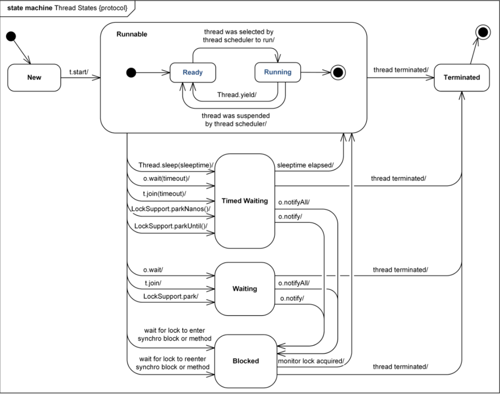

### 基于JDK命令行工具的监控
#### JVM参数类型
- 标准参数：不随版本变化而改变的参数，如-version、-help
- X参数：非标准化参数，比较稳定。如-Xint(解释执行)、-Xcomp(第一次使用就编译成本地代码)、-Xmixed(混合模式，JVM自己决定是否编译成本地代码)
- XX参数：非标准化参数，比较不稳定。主要用于JVM调优和debug，其参数分类如下：
```
# Boolean类型，表示启用或禁用某个属性
-XX:[+-]<name>
# 启用G1垃圾收集器
-XX:+UseG1GC

# 非Boolean类型，表示指定某个属性
-XX:<name>=<value>
# 设置垃圾回收时间占程序运行时间百分比
-XX:GCTimeRatio=10
```

#### JVM运行时参数
```
# 查看初始参数
-XX:+PrintFlagsInitial
# 查看最终参数
-XX:+PrintFlagsFial
# 解锁实验参数
-XX:+UnlockExperimentalVMOptions
# 解锁诊断参数
-XX:+UnlockDiagnosticVMOptions
# 打印命令行参数
-XX:+PrintCommandLineFlags
```
##### jps
类似Linux的ps命令，用于输出Java进程相关信息。
```
# 输出Java进程号和进程名称
jps
# 输出Java进程号
jps -q
# 输出传递给main方法的参数
jps -m
# 输出传递给JVM的参数
jps -v
# 输出main class所在的包名
jps -l
```

##### jinfo
查看正在运行的JVM运行时参数。
```
# 查看对应Java进程运行时参数
jinfo -flag [OPTIONS] VMID
```

#### 虚拟机统计信息
jstat可以查看类装载、垃圾收集、JIT编译信息。
```
# 输出指定Java进程的类装载信息，隔1000毫秒输出，输出10次
jstat -class VMID 1000 10
# 输出执行Java进行的垃圾收集信息
jstat -gc VMID
# 输出Java进程的编译信息
jstat -compiler VMID
```

#### 内存溢出
##### 导出内存映像文件
- 内存溢出自动导出：-XX:HeapDumpOnOutOfMemoryError
```
# 设定堆内存大小为20M，当堆内存溢出时在当前目录生成dump文件
-Xms20M -Xmx20M -XX:+HeapDumpOnOutOfMemoryError -XX:HeapDumpPath=./
```
- 使用jmap命令手动导出
```
# 生成并转储heap dump文件
jmap -dump:format=b,file=/tmp/dump/heap.hprof VMID
# 查看指定Java进程的heap dump 
jmap -heap -VMID
```
#### 死循环与死锁
jstack可以用于生成某一时刻虚拟机的线程快照，可以显示Java虚拟机中每个线程正在执行的方法堆栈的集合，从而知道线程在做什么操作或在等待什么资源。
```
# 输出线程快照到文件
jstack VMID > /tmp/dump/thread.dump
```
###### Java线程状态
- NEW：未启动，还未调用线程的start()方法
- RUNNABLE：正在JVM中运行
- BLOCKED：受阻塞并等待监视器锁
- WAITING：无限期地等待另一个线程的特定操作
- TIMED_WAITING：有限期地等待另一个线程的特定操作
- TERMINATED：线程已退出

